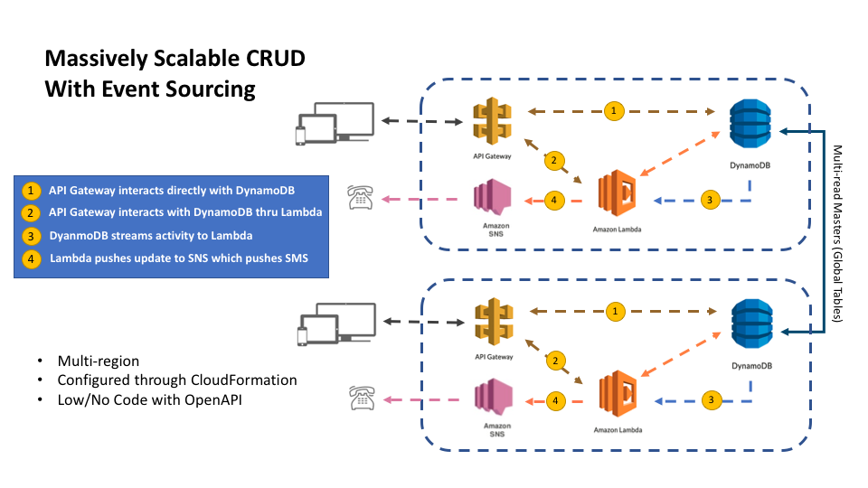

# AWS + OpenAPI

A fast, massively scalable sample CRUD application with simple eventing that harnesses the power of AWS and OpenAPI.

### Table of Contents

* [What This Is](#what-this-is)
* [What You'll Need](#what-youll-need)
* [Setting It Up](#setting-it-up)
* [Making Sure It Works](#making-sure-it-works)
* [How It Works](#how-it-works)
  * [How to Customize](#srcmainresourcesopenapiyaml)
* [The Test Harness](#the-test-harness)
* [Taking It Further](#taking-it-further)
* [Cleaning Up](#cleaning-up)

### What This Is

Leveraging AWS, OpenAPI and BDD testing methodologies this a fast, massively scalable API created entirely through configuration, leveraging each of the technologies to simplify development and deployment.

* Amazon Web Services
  * [API Gateway](https://aws.amazon.com/api-gateway/) - To manage resource requests to AWS Lambda or DynamoDB
  * [AWS Lambda](https://aws.amazon.com/lambda) - To handle transformation of data
  * [DynamoDB](https://aws.amazon.com/dynamodb/) - A multi-master (e.g. read/write), regionally scalable
  * [AWS SNS](https://aws.amazon.com/sns/) - Alerting you in real time to changes in data
* [OpenAPI 3.x](https://www.openapis.org/) with AWS extensions (for deployment)
* [BDD For All](https://github.com/accenture/bdd-for-all) - A behavorial driven development grammar/test harness from Accenture



> Add Route 53 to route traffic based on best consumer region - https://medium.com/fintech-studios-engineering/automatic-multi-region-api-failover-and-geo-proximity-routing-on-aws-271f57752c1b

## What You'll Need

To run this application and create other API's you'll need the following installed...

* Modern IDE & Environment - Supports Maven, Java 8, NodeJS & Python
* AWS CLI - https://aws.amazon.com/cli/
* AWS CloudFormation Template Flip - https://github.com/awslabs/aws-cfn-template-flip

## What You'll Be Doing

Creating and testing a fast, and multi-region CRUD with no code using documentation and configuration.

**Features**
* CRUD API based on OpenAPI 3.x schema (either example one, or one you write)
* Launches in two regions, but can scale to all easily
* For reduced latency, all resources for an API exist within same region
  * All in-region resources resources configured to scale as well
* Backed by a global DynamoDB instance which makes each region instance multi-master read/write
* Change notifications sent via real time VIA SMS
* No code, other than reusable lambdas that could be used for any API.

## Setting It Up

First we need to generate the configuration.  In src/main/resources/ we have 3 YAML files...

* **aws-resources.yaml** - this outlines most of the components of the cloud formation stack
* **openapi.yaml** - this is the openapi spec for the service
* **aws-extensions.yaml** - these are openapi extensions from AWS that describe the API Gateway deployment

You can learn more about these in the [How This all Works](#how-this-all-works) section.  For now, let's get started.

* Go to the root of this projects directory
* First we need to convert our YAML configurations to AWS JSON.  We'll us the cfn-flip library to do this.
  ```sbtshell
  cfn-flip -j src/main/resources/aws-resources.yaml src/main/resources/aws-resources.json
  ```
  And...
  ```sbtshell
  cfn-flip -j src/main/resources/api-extensions.yaml src/main/resources/api-extensions.json
  ```
  Finally...
  ```sbtshell
  cfn-flip -j src/main/resources/openapi.yaml src/main/resources/openapi.json
  ```
* Next, we'll generate the final cloudformation template from these...
  ```sbtshell
  mvn clean generate-test-resources
  ```

And now we can start launching the stack...

```sbtshell
aws cloudformation create-stack \
  --stack-name ItemsExample \
  --template-body file:///$PWD/target/aws-config.json \
  --capabilities CAPABILITY_IAM \
  --region us-east-1
```

This creates the database, lambdas, and api gateway configuration and publishes demo endpoints in the us-east-1 region.

> You should jump to the console at this point - https://console.aws.amazon.com/cloudformation/home?region=us-east-1#/stacks?filter=active - and make sure it completes without error.  You can also check via the command line using `aws cloudformation describe-stacks --stack-name ItemsExample --region us-east-1` where you should see `"StackStatus": "CREATE_COMPLETE"`

Now, let's do the same for us-west-1...

```sbtshell
aws cloudformation create-stack \
  --stack-name ItemsExample \
  --template-body file:///$PWD/target/aws-config.json \
  --capabilities CAPABILITY_IAM \
  --region us-west-1
```
> Again jump to the console at this point - https://console.aws.amazon.com/cloudformation/home?region=us-west-1#/stacks?filter=active - and make sure it completes without error or check via the command line using the `aws cloudformation describe-stacks --stack-name ItemsExample --region us-west-1` command.

Once both stacks have been created, we want to make sure any database changes are synched between regions.  Since we can't specify global tables in the cloudformation template (as of Feb '19), we just need to issue the following command to bring the east/west databases together...

```sbtshell
aws dynamodb create-global-table \
  --region us-east-1 \
  --replication-group RegionName=us-east-1 RegionName=us-west-1 \
  --global-table-name ItemsExampleTable
```

To validate it worked, check out https://console.aws.amazon.com/dynamodb/home?region=us-east-1#tables:selected=ItemsExampleTable;tab=globaltables

There you should see lines for US East & West in the Global Table regions list.

### Making Sure It Works

In addition to writing an OpenAPI spec, we also write acceptance tests (BDD).  Let's see if the application works by executing those tests...

* First let's get the url's.  The easiest way... 
  ```sbtshell
  { \
  aws cloudformation describe-stack-resources \
    --stack-name ItemsExample \
    --region us-east-1 \
    | grep -C 5 "ApiGateway::RestApi" \
    | grep PhysicalResourceId \
    | sed 's/^.*: //; s/\"//g; s/^/host - https:\/\//; s/,/\.execute-api\.us-east-1\.amazonaws\.com\/demo/g' \
  ; \
  aws cloudformation describe-stack-resources \
    --stack-name ItemsExample \
    --region us-west-1 \
    | grep -C 5 "ApiGateway::RestApi" \
    | grep PhysicalResourceId \
    | sed 's/^.*: //; s/\"//g; s/^/alternative - https:\/\//; s/,/\.execute-api\.us-west-1\.amazonaws\.com\/demo/g' \
  } \
  | cat
  ```
  > Your output should look something like...
  ```sbtshell
  host - https://uoa9j84ufh.execute-api.us-east-1.amazonaws.com/demo/items
  alternative - https://39gzfyhlv9.execute-api.us-west-1.amazonaws.com/demo/items
  ```
* Now open src/test/resources/application.conf and take "host" from the command above (just the URL part) and put it where it says USEAST1 below.  Then take the "alternative" output from above and replace the USWEST1 location as shown below.
  ```json
  bddcore {
  
    request {
  
      server {
        host = "USEAST1"
      }
  
      userAgent = "AWS-OPENAPI-SHOWCASE"
  
    }
  
    vars {
  
      Alternative {
  
        Region = "USWEST1"
  
      }
  
    }
  
  }
  ```
* Now for the SMS notifications, we'll add our phone.  First, we need to know the ARN...
  ```sbtshell
  aws cloudformation describe-stack-resources \
    --stack-name ItemsExample \
    --region us-east-1 \
    | grep -C 5 "AWS::SNS::Topic" \
    | grep PhysicalResourceId  \
    | sed 's/^.*: //; s/\"//g; s/,//g;'  
  ```
  > Your output should look something like...
  ```sbtshell
  arn:aws:sns:us-east-1:XXXXXXXXXXXX:ItemsExample-ChangeEventTopic-Q1W7ED1AEHQK
  ```
* Now we'll register using the arn (the output above) and your cell number
  ```sbtshell
  aws sns subscribe \
  --topic-arn <ARN_FROM_ABOVE> \
  --region us-east-1 \
  --protocol sms \
  --notification-endpoint <YOUR_PHONE>
  ```
  NOTE: Phone needs to include area code and us code (e.g. 15554444)
* Finally, let's execute the tests
  ```sbtshell
  mvn test
  ```
  
If everything looks good, all the tests will past and you should of got a bunch of text messages.  Now you can spin up postman or your favorite tool and start playing with the available endpoints.

> See [The Test Harness](#the-test-harness) section for more on what's happening here and check out the curl.log in the logs/ directory to grab some test curls to play with.

You can get a human readable version of the spec, to better understand what you have to work with, by...

* Going to https://editor.swagger.io/
* Click file -> "Import File"
* Select "/path/to/this/src/main/resources/openapi.yaml"

This will give you and idea of the model and endpoints.  In addition, checkout the logs/ directory.  If you ran the tests, there should be a curl.log.  You can copy those into your favorite tool as well to begin playing.

> To remove all the resources, see [Cleaning Up](#cleaning-up).

More fun, checkout the various consoles for each of the services we've launched...

* https://console.aws.amazon.com/cloudformation/home?region=us-east-1#/stacks (you could do us-west-1 too) - gives you a view of all the resources we just created and some management over them.
* https://console.aws.amazon.com/dynamodb/home?region=us-east-1 - checkout the global table you created and your additional configuration options
* https://console.aws.amazon.com/iam/home?region=us-east-1#/home - the roles and policies you've created
* https://console.aws.amazon.com/lambda/home?region=us-east-1#/functions - the nodejs endpoints you've launched
* https://console.aws.amazon.com/sns/v2/home?region=us-east-1#/home - the SNS topic you created
* https://console.aws.amazon.com/cloudwatch/home?region=us-east-1# - The logs all these new services are producing.

### How It Works

The magic starts with the configuration files mentioned way back in the beginning.  Let's begin with these...

#### src/main/resources/aws-resources.yaml

This file describes and configures the resources needed to run your new service in AWS and includes...

```yaml
  ## the actual table
  ItemsTable:
    Type: AWS::DynamoDB::Table
```

The above starts off the section for the applications database configuration.  It...

* Creates a table - This is the "ItemsTable" section and to make it easier for us to create a global table, we provide a name (e.g. "ItemsExampleTable").  If you wanted to repeat this setup for another application, the "TableName" attribute is actually the only thing you would need to change.
* Creates a scaling role and policy - The "ScalingRole" section allows this table to be managed by AWS Auto-Scaling services for both the DB itself and it's logs - https://docs.aws.amazon.com/AmazonECS/latest/developerguide/autoscale_IAM_role.html
* Creates read and write scalable targets - The "WriteCapacityScalableTarget", "WriteScalingPolicy", "ReadScalingTarget", and "ReadScalingPolicy" sections all tell AWS the scaling rules (e.g. how and when to scale) - https://docs.aws.amazon.com/amazondynamodb/latest/developerguide/AutoScaling.html
* Creates an event stream - "DataTableStream" creates a stream for table change events and registers our Lambda "" as the receiver

```yaml
  LambdaBasicExecutionRole:
    Type: AWS::IAM::Role
```

The above starts off the Lambda configuration.  Here we configure and deploy two lambdas using inline NodeJS code.  This section breaks down to...

* The execution role - "LambdaBasicExecutionRole" gives DynamoDB access to the lambdas, you can use this to configure access to any AWS service - https://docs.aws.amazon.com/lambda/latest/dg/intro-permission-model.html#lambda-intro-execution-role
* Ability to save JSON as a structured DynamoDB document - "SaveToDynamo" is a generic lambda that takes any JSON converts it to a DynamoDB friendly format, adds an ID, and then saves off to the table configured in the "ItemsTable" section.
* Ability to convert DynamoDB JSON to normalized JSON - "DynamoToJSON" is another generic lambda, that simply converts the DynamoDB format back to a JSON format in keeping with the API data model.
* Ability to update DynamoDB - "DynamoJSONUpdate", the last of the generic lambdas, converts a JSON request into an update statement.
* Ability to receive change events from dynamo - "HandleDynamoEvent" takes DynamoDB change events and publishes messages to SNS about what's happened.
* Finally, the "ChangeEventTopic" is the topic that the "HandleDynamoEvent" will use to publish it's messages.

```yaml
  APIGatewayRole:
    Type: AWS::IAM::Role
```

This section simply provides the API Gateway rights to use both DynamoDB and lambda functions so it can handle responses to API requests.

```yaml
  RestAPIv2:
    Type: AWS::ApiGateway::RestApi
```

Finally, the above, is the container for what will be the AWS Gateway deployment. Our OpenAPI document is appended here as part of the `mvn clean compile generate-resources` command.

#### src/main/resources/openapi.yaml

Nothing special here.  If you don't know about OpenAPI, we recommend you learn more - https://www.openapis.org/ - and come back.

You could replace this specification with any, as long as it's OpenAPI 3.x and you could generate a CRUD just for it. By default, this will handle any validations you describe with the spec.  It's pretty powerful for not writing any code!

You can even take this further by enabling transactions on DynamoDB - https://aws.amazon.com/blogs/aws/new-amazon-dynamodb-transactions/ - where you can configure transactional validations making it even more powerful without a line of code.

> Need to call AWS to enable for global tables, if you don't it won't work :)

#### src/main/resources/aws-extensions.yaml

More of AWS' secret sauce, this let's us describe how the endpoints interact with AWS or other services.  Typically this would be in the OpenAPI spec itself, but for readability we broke it out to a separate document and merge it with the same `mvn clean compile generate-resources` command that merges the OpenAPI spec into the AWS Resources document.

In this document there is a matching section for each endpoint, using same canonical structure, just with AWS specific extensions.  For each operation, we have some configuration...

**GET /item/{id}**

```yaml
      x-amazon-apigateway-integration:
        credentials: !GetAtt APIGatewayRole.Arn
        uri: !Sub arn:aws:apigateway:${AWS::Region}:lambda:path/2015-03-31/functions/${DynamoToJSON.Arn}/invocations
        responses:
          default:
            statusCode: "200"
        passthroughBehavior: "when_no_templates"
        httpMethod: "POST"
        type: "aws_proxy"
```

This section tells that any get request should be routed our "DynamoToJSON" described earlier.  API Gateway just acts as a proxy here, passing the request to the function and the response back to the consumer.

**DELETE /item/{id}**

```yaml
      x-amazon-apigateway-integration:
        credentials: !GetAtt APIGatewayRole.Arn
        uri: !Sub "arn:aws:apigateway:${AWS::Region}:dynamodb:action/DeleteItem"
        responses:
          default:
            statusCode: "200"
            responseTemplates:
              application/json: |-
                { "id": "$method.request.path.id" }
        requestTemplates:
          application/json: !Sub |
            {
              "TableName": "${ItemsTable}",
              "Key": {
                "id": {
                  "S": "$input.params('id')"
                }
              }
            }
        passthroughBehavior: when_no_templates
        httpMethod: "POST"
        type: aws
```

This endpoint puts a little more onus on the API Gateway.  It uses it's DynamoBD service integration to send a DELETE request directly to DynamoDB then respond with ID of the deleted item as confirmation.

**PUT /item/{id}**

```yaml
      x-amazon-apigateway-integration:
        credentials: !GetAtt APIGatewayRole.Arn
        uri: !Sub arn:aws:apigateway:${AWS::Region}:lambda:path/2015-03-31/functions/${DynamoJSONUpdate.Arn}/invocations
        responses:
          default:
            statusCode: "200"
        passthroughBehavior: "when_no_templates"
        httpMethod: "POST"
        type: "aws_proxy"
```

The above works like the GET, by proxying to "DynamoJSONUpdate" lambda and taking the path and the body to perform the update.

**GET /items/**

```yaml
      x-amazon-apigateway-integration:
        credentials: !GetAtt APIGatewayRole.Arn
        uri: !Sub arn:aws:apigateway:${AWS::Region}:lambda:path/2015-03-31/functions/${DynamoToJSON.Arn}/invocations
        responses:
          default:
            statusCode: "200"
        passthroughBehavior: "when_no_templates"
        httpMethod: "POST"
        type: "aws_proxy"
```

Like GET /items/{id}, this method works as a proxy to the "DynamoToJSON" lambda so it can return a list of requests.

**POST /items/**

```yaml
      x-amazon-apigateway-request-validator: "Validate body"
      x-amazon-apigateway-integration:
        credentials: !GetAtt APIGatewayRole.Arn
        uri: !Sub arn:aws:apigateway:${AWS::Region}:lambda:path/2015-03-31/functions/${SaveToDynamo.Arn}/invocations
        responses:
          default:
            statusCode: "200"
        passthroughBehavior: "when_no_templates"
        httpMethod: "POST"
        type: "aws_proxy"
```

Like the other endpoints that work as proxies, the POST endpoint does as well. You will notice one difference here...

```yaml
      x-amazon-apigateway-request-validator: "Validate body"
```

The above actually tells the API Gateway to validate the request payload before proxying it.  API Gateway uses the OpenAPI spec descriptors (required,min/max,allowed,etc...) to validate the payload automatically.  This is great if you're actually defining your field level requirements in the spec and is standard (e.g. NOT AWS specific) so the documentation, client libraries and other artifacts generated will also include this information.

> Amazon API Gateway Specs say things like patterns, exclusiveMinimum and other OAS properties don't work, but if you look at the tests, you'll see they actually do!

**Bringing It Together**

We use YAML because it's easier to read and has less markup then the JSON version of the documents.  To make merging easier, however, we convert to JSON.  This is why we have those `cfn-flip` statements.  There is some secret sauce there that we don't want to try to replicate ourselves when it comes to JSON <--> YAML conversion for CloudFormation templates.

When we combine this, with our simple JAVA program that merges all the docs as one we have our final CloudFormation template which describes all resources.  All those `aws cloudformation create-stack` commands really do is send that template off to AWS and telll it what region to push it too.

#### The Test Harness

Using the [BDD For All](https://github.com/Accenture/bdd-for-all) test harness from Accenture,  we created a few test cases to make sure we were truly cross-region and that some of the rules and validations we set up through the OAS Spec were actually working.  

Found in [src/test/resources/features/](src/test/resources/features/), we have test cases that cover invalid requests, checking for create/updates/deletes availablity cross region and more.

> Try writing your own tests, learn the grammar and other functionality available with the BDD For All library at - 

If you look in the logs directory after the tests are executed, you'll find a "curl.log", which has all the tests logged as cURLs that you can import into your favorite application to do some further testing.

### Taking it Further

What if we didn't want a simple NodeJS lambda backing our API, but instead wanted a Reactive JAVA application.  

That's easy!

* Open pom.xml
* Remove the two lines that say "REMOVE ME TO GENERATE SPRING APP"
* Back in the console type `mvn spring-boot:run`

When you see...

```sbtshell
  .   ____          _            __ _ _
 /\\ / ___'_ __ _ _(_)_ __  __ _ \ \ \ \
( ( )\___ | '_ | '_| | '_ \/ _` | \ \ \ \
 \\/  ___)| |_)| | | | | || (_| |  ) ) ) )
  '  |____| .__|_| |_|_| |_\__, | / / / /
 =========|_|==============|___/=/_/_/_/
 :: Spring Boot ::        (v2.1.0.RELEASE)
```

Go to http://localhost:8080 and checkout your docs and somewhat functioning mocks.

#### What Did We Just Do?

The OpenAPITools project - https://github.com/OpenAPITools - has built on what the SmartBear - https://swagger.io/ - done to make some cool tools.  

The section in the pom that you uncommented, is a maven plugin that exposes the OpenAPI Generator project - https://github.com/OpenAPITools/openapi-generator - which allows you to generate client libraries, server stubs, documentation and more for a variety of languages and platforms.

We generated a Spring Reactor shell, the code for which you can find at [src/main/java/io/github/mikeparcewski/demos/awsoas/generated](src/main/java/io/github/mikeparcewski/demos/awsoas/generated).  The shell pretty much contains all the plumbing.  All you really need to do implement, is...

* Add src/main/java/io/github/mikeparcewski/demos/awsoas/generated/api/ItemsApiDelegate.java to the .openapi-generator-ignore file (this keeps it from getting overwritten)
* Then edit ItemsApiDelegate to implement your business logic.

**Aside**

There are a lot of languages to choose from - https://github.com/OpenAPITools/openapi-generator#Overview - and by changing the following line to be the language/framework of your choice...

```xml
<generatorName>spring</generatorName>
```

and this...

```xml
<configOptions>
...
</configOptions>
```

To match the config for your language/framework option, you could build the app in almost any language your want.
  
## Cleaning Up

Remove the global table mapping...

```sbtshell
aws dynamodb update-global-table \
    --global-table-name ItemsExampleTable \
    --replica-updates 'Delete={RegionName=us-east-1,RegionName=us-west-1}' \
    --region us-east-1
```

Remove the US East stack...

```sbtshell
aws cloudformation delete-stack \
  --stack-name ItemsExample \
  --region us-east-1
```

Remove the US West stack...

```sbtshell
aws cloudformation delete-stack \
  --stack-name ItemsExample \
  --region us-west-1
```